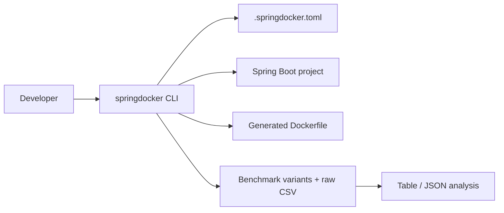

# springdocker

[](https://github.com/mnafshin/springdocker/actions/workflows/ci.yml)
[](https://github.com/mnafshin/springdocker/actions/workflows/release.yml)
[](https://github.com/astral-sh/ruff)
[](./pyproject.toml)
[](./docs/benchmark-methodology.md)

Developer toolkit for Spring Boot containerization and benchmark-driven JVM tuning.

`springdocker` is a Python CLI that helps you inspect a Spring Boot project, generate a Dockerfile, create benchmark assets, run benchmark suites, and summarize benchmark results.

## Why springdocker instead of Jib or Buildpacks?

- **Jib** and **Buildpacks** optimize for build convenience and opaque image assembly.
- **springdocker** optimizes for teams that want a **real Dockerfile they can own, read, and edit**.
- It combines explicit Dockerfile generation with explainability and verification workflows.

See [`docs/POSITIONING.md`](docs/POSITIONING.md) for the detailed comparison and tradeoffs.

## Architecture



See `docs/architecture.md` for the detailed module map and command lifecycle.

The repo is split into these main surfaces:

- `src/springdocker/` - installable CLI package and core implementation.
- `cli/README.md` - command reference and configuration details.

See [Sample project map](#sample-project-map) for which Spring Boot path to use.

## What it does

- Detects Maven or Gradle projects.
- Writes a starter `.springdocker.toml` config.
- Generates optimized Dockerfiles for the sample workflow.
- Pins generated base images by digest when known.
- Creates benchmark variants and runs benchmark suites.
- Summarizes benchmark CSV output as a table or JSON.

Digest update automation template: `.github/renovate.json`

## Sample project map

| Path | Role | Use when |
|---|---|---|
| `examples/spring-boot-maven/` | Human walkthrough (Maven) | Learning the CLI or trying Dockerfile generation |
| `examples/spring-boot-gradle/` | Human walkthrough (Gradle) | Same, for Gradle projects |
| `tests/fixtures/{maven-only,gradle-only}/` | CI golden samples | Running or extending automated tests ([`docs/golden-samples.md`](docs/golden-samples.md)) |
| `samples/java-spring-docker/` | Benchmark harness + evidence | Running benchmark scenarios and comparing `raw.csv` results |

Gradle walkthroughs use `examples/spring-boot-gradle/` with the same commands below.

## Quick start

```bash
cd /path/to/your-repo
python3 -m venv .venv
. .venv/bin/activate
python3 -m pip install -e .
python3 -m pip install -e '.[benchmark]'

# Dockerfile workflow — start with examples/
springdocker doctor --project-root examples/spring-boot-maven
springdocker init --project-root examples/spring-boot-maven --build-tool maven
springdocker inspect --project-root examples/spring-boot-maven --format json
springdocker dockerfile generate --project-root examples/spring-boot-maven --output Dockerfile.generated --recipe jvm-balanced
springdocker explain --project-root examples/spring-boot-maven Dockerfile.generated --format json
springdocker verify --project-root examples/spring-boot-maven Dockerfile.generated

# Benchmark workflow — use the full sample app under samples/
springdocker benchmark generate --project-root samples/java-spring-docker --java-version 25
springdocker benchmark run --project-root samples/java-spring-docker --profile quick
springdocker benchmark analyze --project-root samples/java-spring-docker samples/java-spring-docker/benchmarks/04-custom-jre-jlink/results/raw.csv
springdocker benchmark compare --project-root samples/java-spring-docker samples/java-spring-docker/benchmarks/03-custom-jre-jlink/results/raw.csv --baseline-variant with-jlink-runtime
```

## CLI workflow

1. `doctor` checks the project root and build tool.
2. `init` writes a starter config file.
3. `dockerfile generate` writes a Dockerfile to the requested path.
4. `benchmark generate` creates benchmark scenarios.
5. `benchmark run` executes the benchmark runner.
6. `benchmark analyze` turns `raw.csv` into a table or JSON summary.

See `cli/README.md` for the command reference and config precedence rules.

## Benchmark methodology

See `docs/benchmark-methodology.md` for the benchmark model, run profiles, and summary calculations.

Benchmarks are an optional evidence subsystem and require benchmark extras (`springdocker[benchmark]`).

The sample project keeps benchmark scenarios under `samples/java-spring-docker/benchmarks/`.
Each scenario stores generated Dockerfiles and a `results/raw.csv` file so the output stays reproducible and easy to compare.
Versioned reference datasets are under `samples/java-spring-docker/benchmarks/reference/`.

Current reports focus on:

- image size
- build duration
- startup latency
- success rate

Benchmark summaries can be rendered as:

- terminal tables
- JSON

## Supported stack

This repository currently targets:

- Python 3.10+ for the CLI
- Maven or Gradle Spring Boot projects
- Spring Boot 4.0.1 sample project
- Java 25 sample configuration

## Project docs

### Implemented docs

- `docs/architecture.md`
- `docs/benchmark-methodology.md`
- `docs/golden-samples.md`
- `docs/extensions.md`
- `docs/security-hardening.md`
- `docs/observability.md`
- `docs/kubernetes.md`
- `docs/adr/README.md`
- `docs/multiarch.md`
- `docs/onboarding.md`
- `docs/troubleshooting.md`
- `docs/jvm-optimization.md`
- `SECURITY.md`
- `CONTRIBUTING.md`

### Roadmap docs (not implemented yet)

- `docs/example-gallery.md`
- `docs/benchmark-dashboard.md`
- `docs/native-image-roadmap.md`
- `docs/distribution.md`
- `docs/compatibility-matrix.md`

## Comparison with adjacent tools

| Tool | Focus | What springdocker adds |
|---|---|---|
| Jib | Dockerless image build | benchmark-aware Dockerfile and runtime tuning workflows |
| Buildpacks | Opinionated platform build | explicit Dockerfile generation and benchmark artifacts |
| Manual Dockerfiles | Full control | project detection, config, and repeatable benchmark analysis |

## Sample project docs

- `examples/README.md` - walkthrough projects by build tool
- `docs/golden-samples.md` - CI fixtures and variant coverage
- `samples/java-spring-docker/README.md` - full benchmark sample app
- `samples/java-spring-docker/HELP.md`
- `samples/java-spring-docker/k8s/kustomization.yaml`
- `samples/java-spring-docker/tools/README.md`

## Contributing

The main package is under `src/springdocker/`. Run `pytest`, `ruff check src tests`, and `mypy src` before pushing changes.
